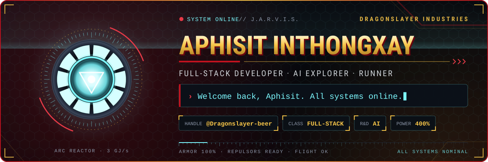
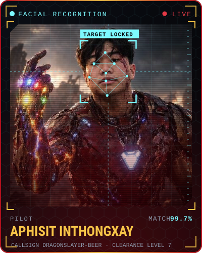
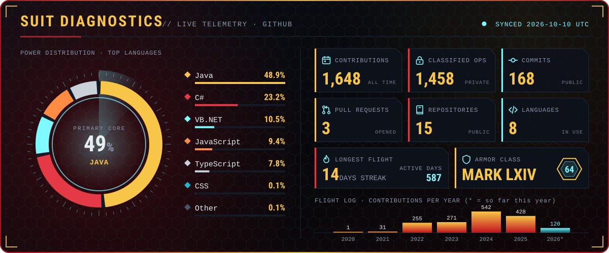
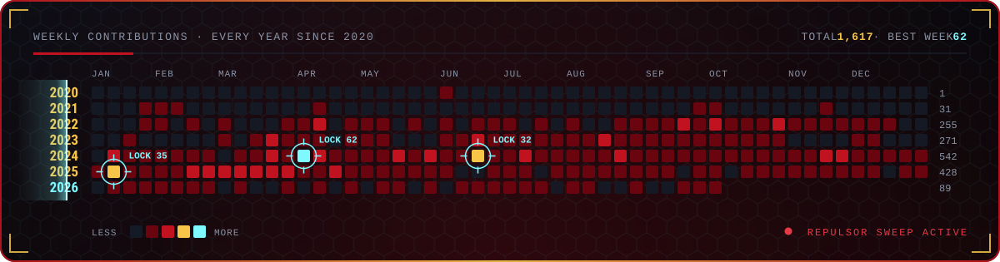
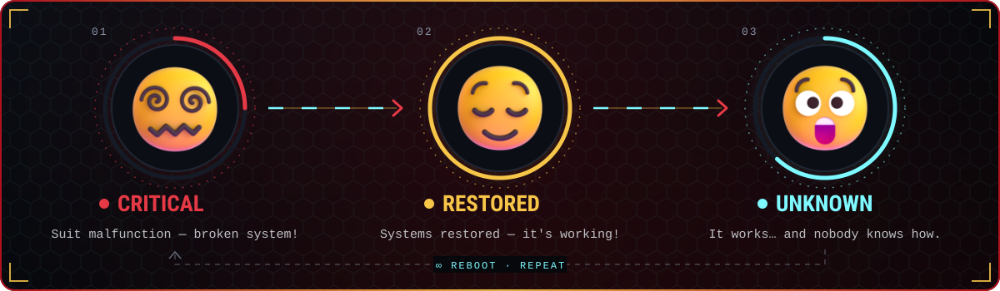
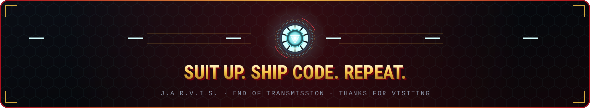

<!--
  ╔═══════════════════════════════════════════════════════════════════╗
  ║  J.A.R.V.I.S. HUD · IRON MAN THEME                                ║
  ║  • Artwork   → assets/ironman/*.svg (generated, don't hand-edit)  ║
  ║  • Text      → ironman/config.mjs  (push → GitHub Action rebuilds)║
  ║  • Live stats refresh daily via .github/workflows/ironman-hud.yml ║
  ╚═══════════════════════════════════════════════════════════════════╝
-->

<!-- ─────────────────────────── 01 · PILOT PROFILE ─────────────────────────── -->

<picture>
  <source media="(prefers-color-scheme: dark)" srcset="https://raw.githubusercontent.com/Dragonslayer-beer/DragonSlayer-beer/main/assets/ironman/section-pilot-dark.svg" />
  
</picture>

-  &nbsp;**Current mission** — I'm learning **frontend and backend**, upgrading the suit one Mark at a time.
-  &nbsp;**R&D lab** — I like exploring **AI**. One day I'll build my own J.A.R.V.I.S.
-  &nbsp;**Comms open** — ask me about **building, movies, games, running, workouts, travel, or anything**.
-  &nbsp;**Arc reactor fact** — regular running lowers resting heart rate and reduces the risk of heart disease by up to 50%.

> *"Sometimes you gotta run before you can walk."* — Tony Stark

 

<!-- ─────────────────────────── 02 · ARSENAL ─────────────────────────── -->

<picture>
  <source media="(prefers-color-scheme: dark)" srcset="https://raw.githubusercontent.com/Dragonslayer-beer/DragonSlayer-beer/main/assets/ironman/section-arsenal-dark.svg" />
  
</picture>

  
   
  
  
  
  
   
  
  
  
  

  
   
  
  
  
  

  
   
  
  
  
  
  

  
   
  
  
  
  
  

<!-- ─────────────────────────── 03 · SUIT DIAGNOSTICS ─────────────────────────── -->

<picture>
  <source media="(prefers-color-scheme: dark)" srcset="https://raw.githubusercontent.com/Dragonslayer-beer/DragonSlayer-beer/main/assets/ironman/section-diagnostics-dark.svg" />
  
</picture>

<!-- ─────────────────────────── 04 · REPULSOR TARGETING ─────────────────────────── -->

<picture>
  <source media="(prefers-color-scheme: dark)" srcset="https://raw.githubusercontent.com/Dragonslayer-beer/DragonSlayer-beer/main/assets/ironman/section-repulsor-dark.svg" />
  
</picture>

<!-- ─────────────────────────── 05 · SUIT STATUS LOG ─────────────────────────── -->

<picture>
  <source media="(prefers-color-scheme: dark)" srcset="https://raw.githubusercontent.com/Dragonslayer-beer/DragonSlayer-beer/main/assets/ironman/section-status-dark.svg" />
  
</picture>

Iron Man fan theme · not affiliated with Marvel · HUD artwork generated by <code>ironman/build.mjs</code> and refreshed daily by GitHub Actions

