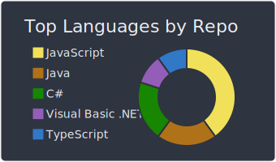
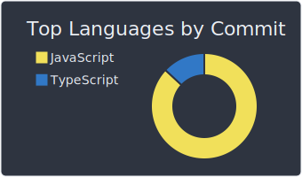
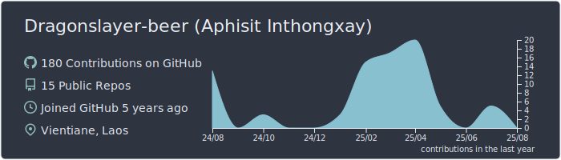

  
  

-   &nbsp; I’m learning **frontend and backend**.  
- &nbsp;&nbsp;&nbsp; I like exploring **AI**.  
- &nbsp;&nbsp; Ask me about **building, movies, games, running, workouts, travel, or anything**.  
- &nbsp;&nbsp;&nbsp;&nbsp;&nbsp;&nbsp;Fun fact: Regular running lowers resting heart rate and reduces the risk of heart disease by up to 50%. 

  
More stats

  

  

**Code Cycle** 

&nbsp;&nbsp;&nbsp;&nbsp;&nbsp;

&nbsp;&nbsp;&nbsp;&nbsp;&nbsp;
 

